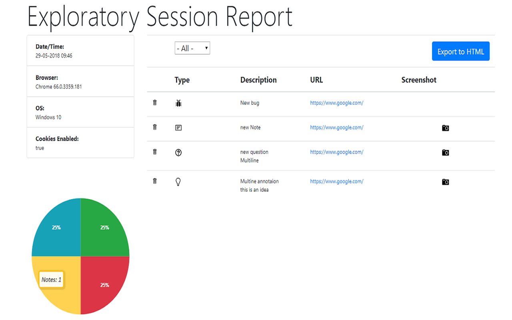

# A Chrome Extension for Exploratory Testing

A Chrome extension designed for making web exploratory testing easier

**Features**

 - Report bugs, ideas, notes and questions easily
 - Take screenshots during the session. Keep focused 
 - URL will be tracked automatically
 - See session results in a report
 - Export and import sessions
 - Export session to JSON, CSV or HTML


Install from [Chrome Store](https://chrome.google.com/webstore/detail/exploratory-testing-chrom/khigmghadjljgjpamimgjjmpmlbgmekj)


**Annotate any thought while you test easily and take screenshots without changing context**


**View session results in a report**



## Development and Testing

This section provides instructions for setting up the project locally for development and running tests.

### Project Setup

1.  **Prerequisites**: Ensure you have [Node.js](https://nodejs.org/) installed (which includes npm).
2.  **Clone the Repository**:
    ```bash
    git clone https://github.com/your-username/your-repo-name.git
    cd your-repo-name
    ```
    *(Using a common placeholder format for the repo URL. The user can update this if they wish).*
3.  **Install Dependencies**:
    ```bash
    npm install
    ```
    This will install Jest, Babel, and other necessary development dependencies as defined in `package.json`.

### Running Tests

The project uses [Jest](https://jestjs.io/) for unit testing.

1.  **Execute Tests**:
    ```bash
    npm test
    ```
    Alternatively, you can run Jest directly:
    ```bash
    npx jest
    ```
2.  **Test Results**: Most tests should pass.
    *   **Known Issue**: The test suite for `test/spec/ExportSessionCSV.test.js` is currently non-functional due to a syntax error that occurred during the migration to Jest and could not be resolved with available tools. This specific suite will fail or be skipped. All other test suites should pass.

---
_PS: I'm not a web designer, so any help with web design or UX will be appreciated._

twitter: @morvader
