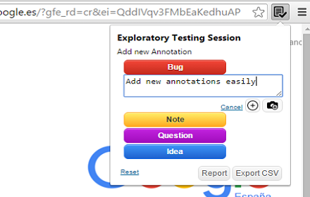
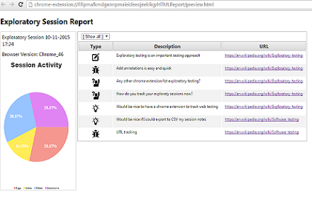

# A Chrome Extension for Exploratory Testing

A Chrome extension designed for making web exploratory testing easier

**Features**

 - Report bugs, ideas, notes and questions easily
 - Take screenshots during the session. Keep focused 
 - URL with be tracked automatically
 - See session results in a report
 - Export session to CSV or HTML

Install from [Chrome Store](https://chrome.google.com/webstore/detail/exploratory-testing-chrom/khigmghadjljgjpamimgjjmpmlbgmekj)

**Annotate any thought while you test easily and take screenshots without changing context**

**Watch session results in a report**

_PS: I'm not a web designer, so any help with web design or UX will be appreciated._

twitter: @morvader
