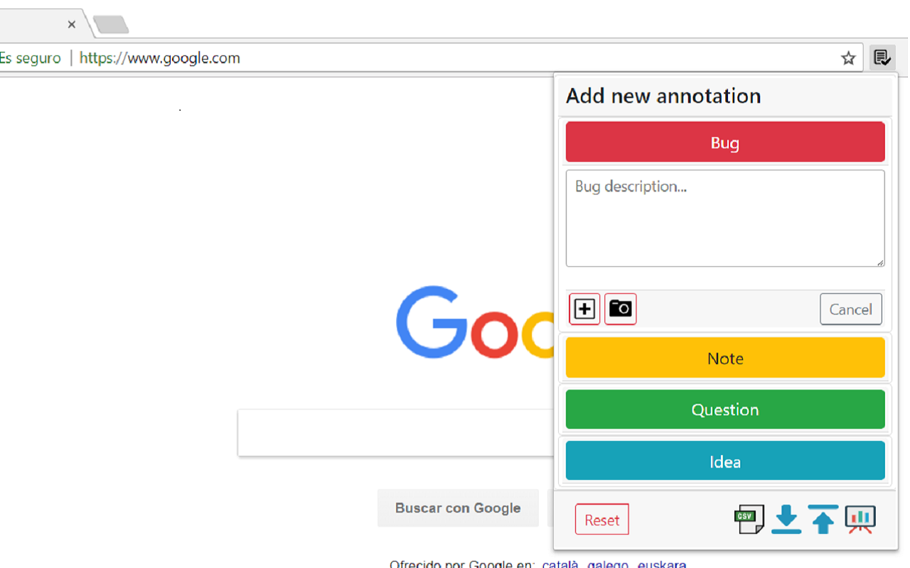
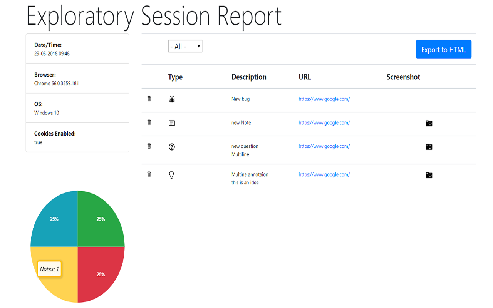

# Exploratory Testing Chrome Extension — QA Bug Reporter & Test Session Manager

> A free Chrome extension for manual and exploratory testing. Capture bugs, ideas, notes and questions with annotated screenshots — without breaking your testing flow.

[](https://chrome.google.com/webstore/detail/exploratory-testing-chrom/khigmghadjljgjpamimgjjmpmlbgmekj)
[](https://github.com/morvader/ExploratoryTestingChromeExtension/releases)
[](LICENSE)

---

## What Is Exploratory Testing?

**Exploratory testing** is a manual QA technique where testers simultaneously design and execute tests, learning about the application as they go. It's especially effective for uncovering edge cases, usability bugs, and unexpected behavior that scripted test cases miss.

This extension was built specifically to support exploratory testing sessions: it stays out of your way while you test, and lets you record findings instantly with a single click.

---

## Key Features for QA Testers

| Feature | Description |
|---|---|
| **Bug reporting** | Log bugs instantly with description and screenshot |
| **Annotated screenshots** | Draw arrows, boxes and text directly on screenshots |
| **Notes & ideas** | Capture observations and improvement ideas mid-session |
| **Questions** | Flag questions for developers or product owners |
| **Automatic URL tracking** | Every annotation records the page URL automatically |
| **Session management** | Start, pause, reset or export full testing sessions |
| **HTML test report** | Visual session summary with charts and filterable table |
| **CSV export** | Open your test session data in Excel or any spreadsheet |
| **JSON export/import** | Share or archive full sessions with all metadata |
| **Zero context switching** | Annotate without leaving the page you're testing |

---

## Why Use This for Manual & Exploratory Testing?

- **QA teams** running sprint testing cycles need a fast way to capture findings without filling bug trackers mid-session.
- **Solo testers** doing acceptance testing or regression checks can record everything in one place.
- **UX reviewers** and **product teams** use it to collect notes and ideas during demos or reviews.
- **Bug triage** is easier with screenshots already annotated and linked to the original URL.

---

## Screenshots

**Add a bug, note, idea or question in one click — stay focused on testing**



**View a full session report with charts, filters and export options**



---

## Installation

Install directly from the **[Chrome Web Store](https://chrome.google.com/webstore/detail/exploratory-testing-chrom/khigmghadjljgjpamimgjjmpmlbgmekj)**.

Or load unpacked for development — see [Development Setup](#development-and-testing) below.

---

## How It Works

1. **Start a testing session** — open the extension popup and begin exploring the application under test.
2. **Record findings instantly** — click Bug / Note / Idea / Question, add a description, optionally capture and annotate a screenshot.
3. **Keep testing** — the extension tracks URLs automatically. All annotations are saved to local storage.
4. **Export your session** — generate an HTML report, export to CSV for your test management tool, or save as JSON.

---

## Annotation Types

| Type | Use case |
|---|---|
| 🐛 **Bug** | Defect or unexpected behavior found during testing |
| 📝 **Note** | Observations, context or things to follow up on |
| 💡 **Idea** | Improvement suggestions or new test scenarios |
| ❓ **Question** | Clarifications needed from devs or product owners |

---

## Export & Reporting

- **HTML Report** — standalone file with embedded screenshots, filterable annotation table and session statistics chart. Shareable with stakeholders without any dependencies.
- **CSV Export** — compatible with Excel, Google Sheets, Jira, TestRail and other test management tools.
- **JSON Export/Import** — full session serialization for archiving, sharing between testers, or re-importing later.

---

## Development and Testing

### Prerequisites

- [Node.js](https://nodejs.org/) (includes npm)

### Project Setup

```bash
git clone https://github.com/morvader/ExploratoryTestingChromeExtension.git
cd ExploratoryTestingChromeExtension
npm install
```

### Running Tests

```bash
npm test          # Run all Jest unit tests
npx jest          # Run Jest directly
npx jest --watch  # Watch mode for TDD
```

> **Known issue:** `test/spec/ExportSessionCSV.test.js` has a syntax error from a Jest migration and will fail. All other test suites pass.

### E2E Tests

```bash
npx playwright test   # Run Playwright end-to-end tests
```

See [TESTING-E2E.md](TESTING-E2E.md) for the full E2E testing guide.

### Build for Chrome Web Store

```powershell
.\genetareZip.ps1   # Creates a timestamped .zip ready for upload
```

---

## Tech Stack

- **Manifest V3** Chrome Extension
- jQuery 1.11.3 + Bootstrap CSS (popup UI)
- Chart.js (session report charts)
- JSZip (screenshot ZIP download)
- Jest 29 + Babel (unit tests)
- Playwright (E2E tests)

---

## Related Topics

`exploratory-testing` · `manual-testing` · `qa-tool` · `bug-reporting` · `chrome-extension` · `test-session-management` · `screenshot-annotation` · `software-testing` · `quality-assurance` · `test-automation`

---

_Contributions welcome. Not a web designer — UI/UX improvements are especially appreciated._

Twitter: [@morvader](https://twitter.com/morvader)
